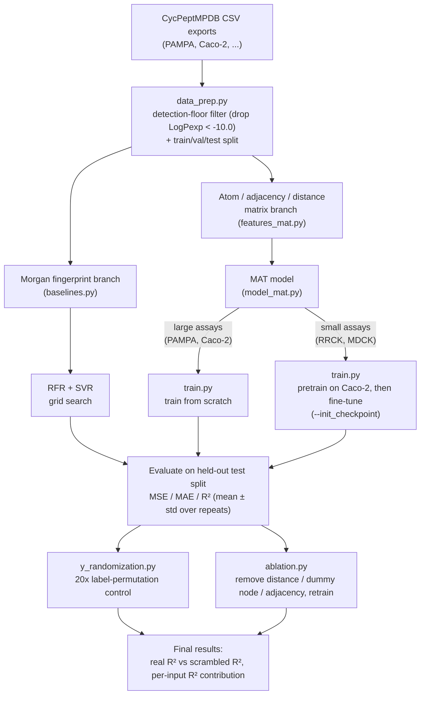

# PermeabilityML Pipeline: Full Methodology Walkthrough

*What data goes in, what gets computed at every stage, and the reasoning behind each choice*

Companion to CPMP_Methodology_Deep_Dive.docx and the cpmp_pipeline codebase (PermeabilityML)

## 0. What This Document Is For

The previous methodology document explained **the CPMP paper** (Jiang, Chen & Du, 2025). This document explains **our own implementation** built against your CycPeptMPDB exports: exactly which columns of data are read, what gets computed from them, how those computations feed the model, and — for every step — **why** that step exists and **what happens if you skip it**. It's written so that every decision in the pipeline has a traceable reason, suitable for defending the methodology chapter of a dissertation.

The structure throughout is deliberately causal: *what it is* → *how it's computed* → *why that specific choice* → *so what (what it changes in the final prediction)*.

## 0.1 Pipeline Workflow at a Glance

Before the step-by-step detail, here's the exact procedure end to end — which script runs when, and how the two feature representations (Section 2) travel through the pipeline in parallel before meeting at evaluation.

Read left to right: everything up to the fork in the middle happens once per assay (PAMPA and Caco-2 are processed independently, per Section 1.5). After the fork, the fingerprint branch and the matrix branch never mix — they're deliberately kept separate so the gap between them (Section 2) stays measurable. `run_pipeline.sh` runs the whole left-to-right chain in order for both PAMPA and Caco-2; the RRCK/MDCK fine-tuning branch is a manual follow-up step once those exports exist (see the pipeline README's "RRCK / MDCK" section).

## 1. The Raw Data: Which Columns We Use, and Why

### 1.1 Where the data comes from

Two CycPeptMPDB per-assay exports are the entire data source for this pipeline:

- CycPeptMPDB_Peptide_Assay_PAMPA.csv — ~7,298 macrocyclic peptides
- CycPeptMPDB_Peptide_Assay_Caco2.csv — ~1,332 macrocyclic peptides

Each row is one peptide. Each export carries roughly 200 columns — identifiers, the SMILES/HELM structure, and a large block of pre-computed RDKit molecular descriptors (molecular weight, TPSA, LogP, Kappa shape indices, and so on). Only a small slice of those ~200 columns is actually used by this pipeline, and section 1.2 explains why.

### 1.2 Columns actually used vs. columns deliberately ignored

| Column | Used for | Why |
|---|---|---|
| SMILES | The only structural input | It is the sole representation both the baseline models and MAT build their features from. Everything the model "knows" about a peptide's shape is derived fresh from this string, not read off a pre-computed column. |
| Permeability (or the assay-named column, e.g. PAMPA / Caco2) | The prediction target (LogPexp) | This is the experimentally measured, log-scaled permeability value — the number the whole pipeline exists to predict. |
| ID | Row identifier only | Used to trace a prediction back to a specific peptide; never fed into the model. |
| ~190 other RDKit descriptor columns (TPSA, EPSA, Kappa*, Chi*, MolLogP, etc.) | Not used as model input | Explained below — this is a deliberate design choice, not an oversight. |

> **Why we don't feed the ~190 pre-computed descriptor columns into the model:** Two reasons. First, apples-to-apples comparison with the paper: CPMP's baselines use Morgan fingerprints computed fresh from SMILES, and CPMP itself computes its atom/adjacency/distance matrices fresh from SMILES too — nothing in the paper's pipeline reads a pre-tabulated descriptor. Second, and more important for interpretation: several of those descriptor columns (TPSA, EPSA, MolLogP) are themselves known to correlate strongly with membrane permeability. If we handed the model TPSA directly, a high R² would partly just be the model rediscovering a known TPSA–permeability correlation, not learning structure-to-permeability relationships from the raw graph and shape. Keeping the input to "SMILES only" keeps the model's job — and the ablation study's conclusions in Section 5 — honest: whatever predictive power we measure has to come from the atoms, bonds, and 3D shape, not from a shortcut.

### 1.3 Choosing the target column

Column detection in **data_prep.py** tries, in order: **Permeability**, then **PAMPA**, **Caco2**, **MDCK**, **RRCK**. The first one present in the file is used as LogPexp. In every CycPeptMPDB per-assay export, this value is already on a log₁₀(cm/s) scale, matching exactly the LogPexp target the CPMP paper predicts — so no additional transform is applied.

### 1.4 The detection-floor filter: dropping LogPexp < −10.0

Before any splitting or modeling happens, every peptide with LogPexp below −10.0 is removed.

> **Why:** −10.0 sits at the assay's detection floor — the point below which the instrument can no longer distinguish "very low permeability" from "no signal at all." A peptide recorded at −10.3 doesn't necessarily permeate less than one recorded at −10.0; both readings just mean "too low to measure precisely." Treating these as real, distinguishable numbers would ask the model to learn structure-to-permeability relationships from labels that are partly measurement noise rather than chemistry.
>
> **So what happens if you skip this filter:** The model spends some of its capacity trying to explain differences between peptides whose true values are indistinguishable, which adds noise to training and can quietly deflate R² on the legitimate part of the range — exactly the failure mode this filter is designed to prevent.

### 1.5 Train / validation / test split logic

| Assay | Split | Why |
|---|---|---|
| PAMPA, Caco-2 (large) | 8 : 1 : 1 (train/val/test) | Large enough (thousands of peptides) to carve out a genuine validation set for early stopping / hyperparameter choice without starving the training set. |
| RRCK, MDCK (small) | 7 : 3 (train/test, no val) | Only 185 and 64 peptides respectively — not enough data to also carve out a third split; a validation set that small would be too noisy to trust for model selection anyway. |

> **Why split by assay instead of pooling everything into one dataset:** PAMPA measures passage across an artificial lipid membrane; Caco-2, MDCK, and RRCK each measure passage across a living cell monolayer, and each of those has its own transporter proteins, tight-junction biology, and assay-specific measurement bias. A LogPexp of −5.0 does not mean the same physical thing in PAMPA as it does in Caco-2. Pooling them would force the model to implicitly learn "which assay produced this row" as a hidden variable, which dilutes the structure–permeability signal you actually want it to learn.

## 2. Two Different Feature Representations — and Why We Need Both

The pipeline builds **two separate representations** of every peptide, for two different jobs:

- **Morgan (circular) fingerprints** — feed the baseline models (Random Forest, SVR). Their entire purpose is to answer: "how well can a standard, well-understood, 2D-only cheminformatics approach do?"
- **Atom / adjacency / distance matrices** — feed the MAT model. This is the representation actually designed to capture 3D folding, which is the paper's central hypothesis for why permeability prediction needs more than a 2D fingerprint.

The gap between what these two representations can achieve *is the experiment* — it's what tells you, quantitatively, how much 3D shape information is worth.

### 2.1 Morgan fingerprints — what they are

A Morgan fingerprint (the algorithm behind what's commonly called ECFP — "Extended Connectivity FingerPrint") is a fixed-length bit vector. Each bit doesn't mean anything on its own; collectively, the pattern of on/off bits encodes which local substructures (small clusters of connected atoms) are present in the molecule.

#### How it's actually computed

- Every heavy atom starts with an initial identifier built from its atomic number, degree, charge, attached-H count, and ring membership — essentially "what kind of atom is this."
- For each iteration up to the chosen radius (we use radius = 2, i.e. "ECFP4"), every atom's identifier is updated by combining its current identifier with its neighbors' identifiers and re-hashing. After one iteration, each atom's identifier represents "me + my direct neighbors"; after two iterations, "me + everything within two bonds."
- Every distinct identifier that appears at any iteration, across the whole molecule, gets hashed into a bit position in a fixed-length vector (we use 1024 bits) — this is the "folding" step that turns an unbounded set of substructure identifiers into a fixed-size vector every molecule can be compared against.

The result: a 1024-length 0/1 vector per peptide, where a 1 at a given position means "at least one local substructure that hashes to this bit is present somewhere in this molecule."

> **Why radius = 2 and 1024 bits specifically:** Radius 2 (ECFP4) is the field-standard middle ground: large enough to capture a functional group and its immediate chemical context (an amide next to an aromatic ring, say), small enough not to blow up into whole-molecule-sized patterns that would be too sparse to generalize across only a few thousand peptides. 1024 bits is likewise a standard size that keeps hash collisions manageable for molecules in the peptide size range. Both choices match how the CPMP paper's own RFR/SVR baselines are built, which keeps the RFR/SVR-vs-MAT comparison meaningful rather than an artifact of using a nonstandard fingerprint.

#### How the fingerprint actually influences a prediction

Random Forest Regressor: builds many decision trees, each of which splits training data on individual bits ("is bit 542 on?") and eventually averages many trees' outputs. In effect it learns rules like "if this substructure is present and that one is absent, permeability tends to be higher."

Support Vector Regression (RBF kernel): instead of splitting on individual bits, it measures how *similar* an unseen peptide's fingerprint is to the training peptides' fingerprints, and predicts a value that's a weighted blend of the training labels of the most similar peptides.

> **What this representation cannot capture — and why that matters for the whole pipeline:** A fingerprint is computed purely from the 2D bond graph. Two different 3D conformations of the exact same molecule — an "open" floppy shape and a "closed" folded shape that hides its polar groups — produce an identical Morgan fingerprint, because the bonds haven't changed, only their spatial arrangement has. Since passive membrane permeability is driven precisely by that open→closed folding behaviour, a fingerprint-only model has a hard ceiling on how well it can ever predict permeability, no matter how it's tuned. That ceiling is exactly what the RFR/SVR baseline numbers measure, and it's exactly what the distance matrix (Section 2.4) is built to break through.

### 2.2 The atom feature matrix

Each heavy atom becomes one row of a per-molecule (N atoms × 43 features) matrix. Every atom's row encodes:

| Feature block | What it encodes | Why it's relevant to permeability |
|---|---|---|
| Atom type (one-hot over 14 elements + "other") | Is this carbon, nitrogen, oxygen, sulfur, a halogen… | Different elements have different electronegativity and hydrogen-bonding behaviour, which is central to whether a group is polar (membrane-repelling) or not. |
| Degree (0–5 neighbours) | How many other atoms it's directly bonded to | A proxy for how buried / exposed / branched a position is. |
| Formal charge (−2 to +2) | Ionisation state | Charged groups are strongly membrane-repelling; this is one of the biggest single levers on permeability. |
| Hybridization (SP / SP2 / SP3 / …) | Local 3D geometry around the atom (linear, planar, tetrahedral) | Constrains what shapes the molecule can fold into — sets up the 3D story that the distance matrix later completes. |
| Total attached H count (0–4) | How many hydrogens this atom carries | Directly relevant to hydrogen-bond donor/acceptor capacity, a first-order driver of permeability. |
| Aromaticity flag | Is this atom part of an aromatic ring | Aromatic rings are rigid and hydrophobic — both matter for how the molecule folds and interacts with a membrane. |
| Ring-membership flag | Is this atom part of any ring | Cyclic peptides' entire permeability story is about ring conformation, so this is a foundational bit. |
| Atomic mass (scaled) | Raw atomic weight | A cheap catch-all correlated with several of the above. |

> **Why this specific feature set:** This is the same "chemical vocabulary" essentially every graph-based molecular model uses (RDKit's standard atom-featurization set). It describes what each atom is and its immediate local chemistry, but says nothing yet about the molecule's overall 3D shape — that's deliberately left to the adjacency and distance matrices, so each of the three inputs has one clear job.

### 2.3 The adjacency matrix

An (N × N) matrix of 0s and 1s: entry (i, j) is 1 if atoms i and j are directly bonded, 0 otherwise. This is exactly the information in a hand-drawn skeletal structure — which atom connects to which.

> **Why the model needs this as an explicit input, not just something it infers:** It guarantees the model always has a hard, unambiguous signal for "these two atoms are chemically bonded," even early in training before the attention mechanism has learned anything useful on its own. The ablation study (Section 5) confirms this matters: removing the adjacency matrix costs a small but measurable amount of R², showing local bond-graph information isn't fully recoverable from the other two inputs alone.

### 2.4 The distance matrix — the centerpiece of the whole approach

An (N × N) matrix, but this time of **actual Euclidean distances** between every pair of atoms in a **3D-optimized conformation** of the molecule — not bond-path distance.

> **Why this is fundamentally different from the adjacency matrix:** Two atoms can be six bonds apart along the peptide backbone and yet sit right next to each other in space, because the macrocycle folds back on itself. That's precisely the phenomenon believed to control passive membrane permeability: a cyclic peptide can adopt a "closed" conformation that tucks its polar amide groups inward (hiding them from the membrane) and presents its hydrophobic side chains outward, versus an "open" conformation that exposes the polar backbone. A representation built only from bond connectivity — fingerprints, adjacency matrix, plain 2D graph neural networks — structurally cannot see this folding at all, because bond count doesn't change when the molecule folds. The distance matrix is the only place 3D shape enters the model.

#### How the 3D structure is actually generated

- RDKit's ETKDG algorithm generates an initial plausible 3D conformer directly from the 2D structure, using known distributions of realistic torsion angles rather than a naive random guess.
- That conformer is then energy-minimized with a fast, deterministic force field — either UFF (Universal Force Field) or MMFF (Merck Molecular Force Field), each tested with and without non-bonded interaction terms (the "+NB" / "−NB" variants) — which nudges bond lengths, angles, and torsions toward a physically reasonable low-energy shape.
- Once minimized, the pairwise Euclidean distance between every pair of atoms in that single optimized conformer is what fills the distance matrix.

> **Why a force field instead of molecular dynamics (the more "correct" approach):** Letting a peptide physically relax via molecular dynamics into its true membrane-permeating conformation would be more physically accurate, but is computationally far too expensive to run on ~7,000+ peptides. A force-field-optimized single conformer is a fast, deterministic approximation that captures most of the useful shape signal at a small fraction of the cost — and the CPMP paper's own ablation across UFF/MMFF and ±NB variants shows the resulting performance differences are tiny (on the order of 0.004–0.009 in MSE/MAE), i.e. this is a low-priority knob, not a critical modeling decision.

> **How much this one matrix actually influences the final prediction:** Of the three structural inputs, removing the distance matrix causes by far the largest drop in R² in the ablation study — larger than removing the dummy node, and larger than removing the adjacency matrix. In other words, empirically, 3D shape information is the single most important ingredient the model has access to. This is the paper's central claim, and it's why every design choice upstream (SMILES-only input, force-field conformer generation, not using pre-computed 2D descriptors) exists to protect the integrity of this one measurement.

## 3. How the Model Combines These Three Inputs

The Molecular Attention Transformer (MAT) is a Transformer whose attention mechanism is deliberately steered by chemistry rather than left to figure out relationships purely from scratch. At every layer, the attention weight between every pair of atoms is a blend of three separate signals:

<i>A = ( λₐ · softmax(QKᵀ/√dₖ)  +  λ_d · g(D)  +  λ_g · A_adj ) V</i>

| Term | What it is | What it contributes |
|---|---|---|
| softmax(QKᵀ/√dₖ) | Ordinary learned Transformer self-attention | Lets the model discover arbitrary, data-driven relationships between atoms that aren't captured by bonds or distance alone. |
| g(D) | A function of the 3D distance matrix (Section 2.4) | Directly pulls atoms that are physically close in the folded 3D structure toward each other's attention, regardless of how far apart they are along the chain — this is the mechanism by which "folding" enters the model's reasoning at every layer. |
| A_adj | The raw bond adjacency matrix (Section 2.3) | Gives directly-bonded atoms a guaranteed attention boost, so local chemical structure is never drowned out by the other two, data-driven signals. |

λₐ, λ_d, and λ_g are scalar weights (summing to 1) controlling how much each signal contributes. The paper finds these by grid search rather than learning them end-to-end; our implementation exposes them as a configurable hyperparameter (three starting presets are shipped, and a proper sweep is recommended before treating final numbers as settled — see the caveats in Section 7).

### 3.1 The dummy node

An extra virtual "atom" with no real chemical meaning is added to every molecule, bonded to all real atoms, purely so the model has a dedicated slot to accumulate whole-molecule information during pooling, instead of being forced to average across real atom representations only.

> **Why this measurably helps:** Plain averaging over all real atoms treats every atom as equally important to the final permeability number, which dilutes the signal from the atoms that actually matter most (e.g. the polar groups doing the hiding/exposing during folding). The dummy node lets the network learn, through training, how to selectively aggregate the whole-molecule signal instead — the ablation study shows removing it costs a real, measurable amount of R², second only to removing the distance matrix.

### 3.2 Stacking it into a single number

Several of these Molecule Self-Attention layers are stacked, each followed by a position-wise feed-forward layer. After the final layer, the dummy node's representation (or a mask-aware mean over atoms, if the dummy node is disabled) is pooled into one whole-molecule vector, which passes through a small fully-connected head to produce one scalar: the predicted LogPexp.

## 4. Training Protocol — Why Two Different Strategies

| Assay group | Strategy | Why |
|---|---|---|
| PAMPA, Caco-2 (large) | Train from scratch: MSE loss, Adam optimizer, early-stop on validation R², report on held-out test set | Thousands of peptides is enough data for a Transformer of this size to learn stable weights without a warm start. |
| RRCK, MDCK (small) | Pretrain a model on Caco-2 first, then fine-tune those weights on the small assay's own training split before testing | With only 185 (RRCK) or 64 (MDCK) peptides, training a Transformer from scratch risks underfitting or unstable optimization. Borrowing weights already tuned on a larger, related, chemically-similar dataset gives the small model a substantial head start instead of learning everything from a handful of examples. |

> **Why this transfer step is trustworthy and not just a convenient hack:** The paper checks, before relying on it, that RRCK and MDCK peptides occupy a similar chemical space to Caco-2 peptides (their Supplementary Fig. S9) — i.e. the transfer is justified empirically, not assumed. The payoff is the single largest effect size reported anywhere in the paper: RRCK R² rises from 0.470 (no pretraining) to 0.623 (with pretraining), and MDCK from 0.412 to 0.727. The general, reusable lesson: when a target dataset is small but a related larger dataset exists, pretrain on the large one first rather than training the small one in isolation.

## 5. How We Judge Whether the Model Is Actually Good

### 5.1 The three headline metrics

| Metric | What it measures | Why it's reported |
|---|---|---|
| MSE (Mean Squared Error) | Average of the squared prediction errors | Penalizes large errors disproportionately — flags whether the model is occasionally very wrong on specific peptides, not just slightly off on average. |
| MAE (Mean Absolute Error) | Average error magnitude, in the same log₁₀ units as LogPexp | The single easiest number for a non-specialist reader to interpret directly ("on average, predictions are off by X log units"). |
| R² (coefficient of determination) | Fraction of the variance in true LogPexp values explained by the model | The headline comparison number — it's what makes RFR/SVR/MAT and different ablations directly comparable to each other and to the paper's own reported numbers. |

Each metric is computed for several repeated training runs (3, matching the paper) with different random seeds and reported as mean ± standard deviation, so a single lucky or unlucky initialization doesn't get mistaken for a real result.

### 5.2 Y-randomization: checking the result isn't a fluke or a leak

Procedure: take the real training labels, randomly permute them so each peptide is paired with a different peptide's permeability value, then retrain the identical model on this scrambled data. Repeat 20 times with different permutations, and compare the resulting test R² to the real-label R².

> **Why this matters specifically for CycPeptMPDB data:** CycPeptMPDB is known to contain the same physical peptide reported under multiple literature sources (visible in columns like Same_Peptides_ID in the raw export). If a duplicate ends up in both the training split and the test split, the model can score deceptively well on the test set by essentially memorizing a value it already saw during training — without having learned any real structure–permeability relationship. A large gap between real-label R² and scrambled-label R² (the paper's real data: R² ≈ 0.67 PAMPA / 0.75 Caco-2, collapsing to ≈ 0.10 / 0.09 on scrambled labels, i.e. noise level) is evidence the reported performance reflects genuine learning, not a split leak. This is a cheap, convincing insurance check worth running before trusting any final number.

### 5.3 Ablation: which input is actually doing the work

Each of the three structural inputs — distance matrix, dummy node, adjacency matrix — is removed in turn and the model is retrained from scratch, to measure that component's individual contribution to R².

> **Why remove one thing at a time rather than just reporting the full model's score:** A single R² number for the full model tells you the model works; it doesn't tell you which piece of information is responsible. Removing one input at a time, keeping everything else fixed, isolates each input's individual causal contribution — this is what lets the paper (and this pipeline) make the specific, defensible claim that 3D distance information matters more than either the 2D bond graph or the pooling mechanism, rather than a vaguer claim that "the model works well overall."

## 6. Cause-and-Effect Summary

A single table tying every step back to its reason and its consequence if skipped.

| Step | What we do | Why | If skipped |
|---|---|---|---|
| Detection floor | Drop LogPexp < −10.0 | Those values are below the assay's measurable range | Model fits noise at the low end, hurting overall accuracy |
| Assay-separated splits | Model each assay (PAMPA, Caco-2, …) independently | Each assay is a physically different barrier with different biases | Model implicitly has to learn "which assay is this," diluting the structure–permeability signal |
| SMILES-only input | Never feed pre-computed descriptor columns to the model | Keeps comparison to the paper fair; avoids handing the model a permeability-correlated shortcut (e.g. TPSA) | R² becomes partly an artifact of restating a known descriptor–permeability correlation |
| Morgan fingerprints (baselines) | 1024-bit, radius-2 circular fingerprint per peptide | Standard, well-understood 2D-only representation to set a comparison ceiling | No fair reference point for how much 3D information is worth |
| Atom feature matrix | Per-atom chemistry (type, charge, hybridization, …) | Standard chemical vocabulary describing what each atom is | Model has no basis for atom-level chemistry at all |
| Adjacency matrix | Binary bonded/not-bonded matrix | Guarantees the model always has hard 2D connectivity information | Small but measurable R² loss (confirmed by ablation) |
| Distance matrix (3D conformer) | Pairwise Euclidean distances in a force-field-optimized 3D structure | The only place 3D folding — believed to drive passive permeability — enters the model | Largest R² loss of any single component removed (confirmed by ablation) |
| Dummy node | Virtual whole-molecule pooling node | Avoids diluting signal via plain atom averaging | Second-largest R² loss after the distance matrix |
| Pretrain → fine-tune (RRCK/MDCK) | Warm-start small-assay training from a Caco-2-trained model | Too little data (64–185 peptides) to train stably from scratch | Largest single effect size in the paper is lost — R² stays far lower on small assays |
| Y-randomization | 20× label-permutation retraining | Detects whether performance depends on a duplicate-peptide split leak | A leak could inflate reported R² without being detected |
| Ablation study | Remove each structural input in turn | Attributes performance to a specific input, not just "the model overall" | No defensible claim about which piece of information matters most |

## 7. Honest Caveats for the Write-Up

- **λ weights:** the paper's exact grid-searched values for λₐ/λ_d/λ_g aren't published; the implementation ships three starting presets and a proper sweep on real data is recommended before final numbers are treated as settled.
- **MGNN baseline:** only the fingerprint baselines (RFR, SVR) are implemented so far, not the paper's 2D graph-neural-network baseline (MGNN) — worth adding if the "MGNN vs. MAT isolates the 3D contribution" comparison specifically is needed.
- **3D embedding failures:** a small fraction of large or unusual peptides can fail 3D conformer generation; these currently fall back to a topological (bond-count) distance matrix rather than being dropped, flagged internally via a conformer_ok status — worth checking how often this fires on the real dataset before treating results as uniform across all peptides.
- **Duplicate-peptide leakage:** the pipeline does not yet cross-reference CycPeptMPDB's Same_Peptides_ID field to guarantee duplicates never span train/test; the Y-randomization control (Section 5.2) is the current safeguard, but a scaffold- or duplicate-aware split would prevent the risk upstream rather than just detecting it after the fact.
